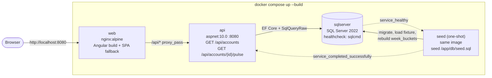
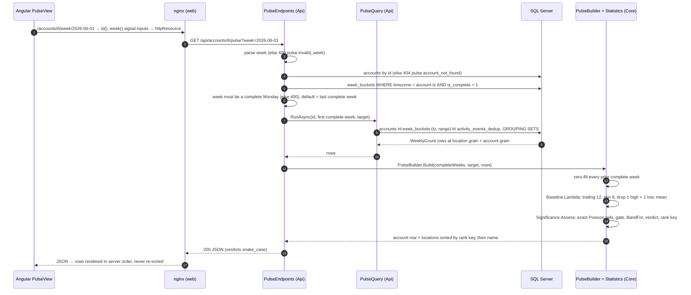
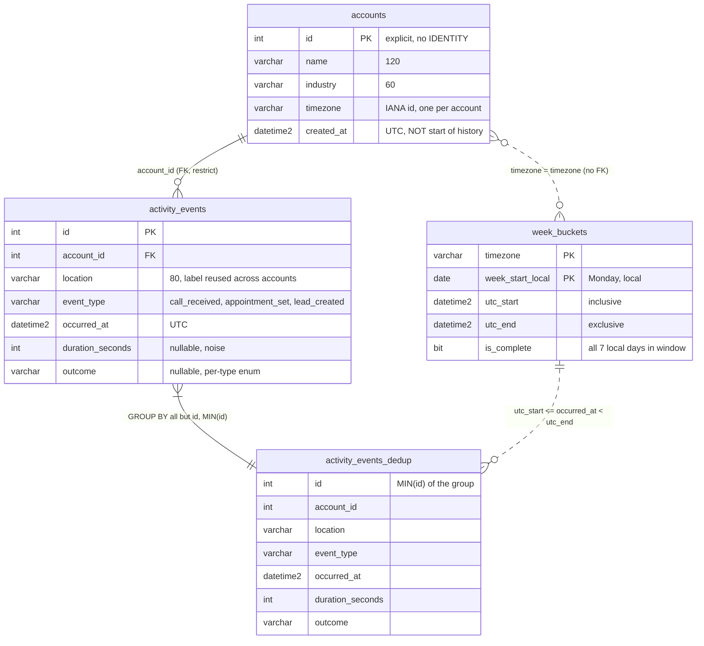
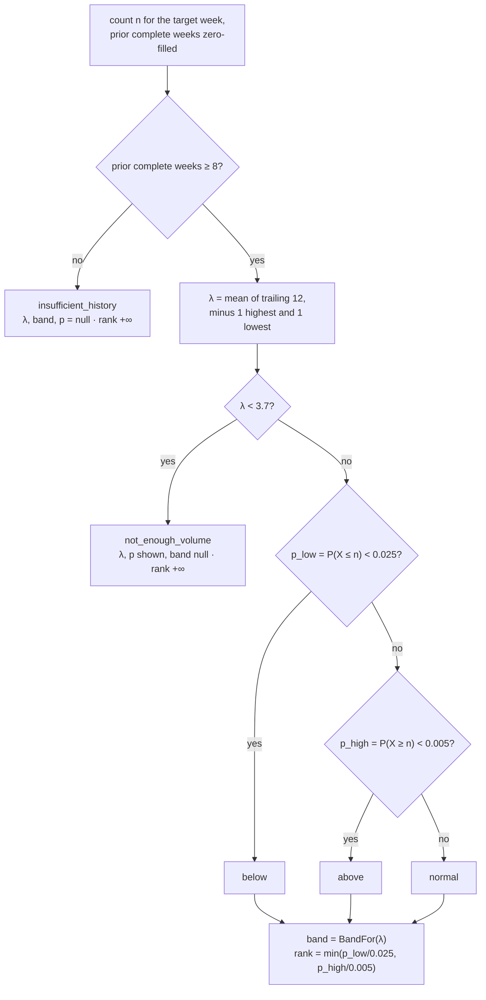
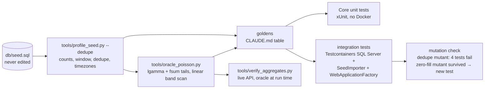

# Relay Pulse — architecture

This describes the code as built. `PLAN.md` is rev 1 and describes an older model. Where the two
disagree, the code and the tests win. Diagrams are Mermaid, which GitHub renders inline.

## 1. Runtime

Start order is `sqlserver` (healthy) → `seed` (exits 0) → `api` → `web`. The seed step is
idempotent: the fixture loads once, and `week_buckets` is regenerated on every run. nginx serves
`/api` on the same origin, so there's no CORS. For local dev without containers, `ng serve`
(:4200, `proxy.conf.json`) talks to `dotnet run` (:5117) instead, with only `sqlserver` in Docker.

## 2. `GET /api/accounts/{id}/pulse?week=YYYY-MM-DD`

The aggregation runs as one parameterised statement. It joins events onto the account timezone's
precomputed weeks with a range join (`utc_start <= occurred_at < utc_end`), which makes weeks
account-local and DST-correct. The query fetches every complete week up to the target, not just
the 12-week window: zero-fill is only correct if "no rows" means "no events". An account with no
events (account 20) returns 200 with `state: "empty"` and `insufficient_history`.

## 3. Data model

`accounts` and `activity_events` mirror `db/schema.sql` (EF migration `InitialSchema`).
`activity_events_dedup` is a view (migration `ActivityEventsDedupView`) that takes 12,626 raw rows
down to 12,614, and every reporting read goes through it. `week_buckets` is keyed by timezone,
not by account (6 zones × 27 weeks = 162 rows, 150 complete). `SeedImporter` builds it in C# with
`TimeZoneInfo` from the global `MIN/MAX(occurred_at)`, never from the wall clock.

## 4. Verdict

The constants are `Baseline.Window = 12`, `Baseline.MinWeeks = 8`, `Significance.MinLambda = 3.7`,
`AlphaLow = 0.025` and `AlphaHigh = 0.005`. The band is the set of integer counts that `Assess`
would call normal, found by binary search on the same tails, so the band and the verdict can't
disagree. The rank key is < 1 exactly when a row is flagged, so flagged rows always sort first.

## 5. Verification

The Python oracles are a separate implementation in another language. They use different
algorithms from the C#: per-term `lgamma` + `fsum` rather than a log-space recurrence, and a
linear band scan rather than a binary search. A golden that no oracle prints isn't a golden.
Integration tests skip with a message when Docker is absent, so `dotnet test` passes either way.
`verify_aggregates.py --base-url http://localhost:8080` runs the same cross-check through the
nginx container.
